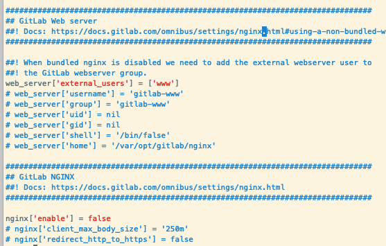

# 安装（Debian 系列系统为例）

## apt-get 直接安装

更新gitlab源
```
curl -s https://packages.gitlab.com/install/repositories/gitlab/gitlab-ce/script.deb.sh | sudo bash
```

安装，默认最新版
```
sudo apt-get install gitlab-ce
```

# 进阶（Debian 系列系统为例）

## 已有Nginx，想用原来的服务

停gitlab自带的nginx，并且修改外部web server权限用户。
```$xslt
sudo vim /etc/gitlab/gitlab.rb
```

修改地方，如下图：



修改完，重新加载配置&重启即可。
```
#重新加载配置
sudo gitlab-ctl reconfigure

#重启
sudo gitlab-ctl restart

```

## 定期备份与清理

### 备份

> 1、创建备份脚本，每天00自动备份

sudo vim /var/opt/gitlab/backups/remove.sh  
```
#!/bin/bash
0 0 * * * sh /var/opt/gitlab/backups/backup.sh >> /var/opt/gitlab/backups/backup.log
```

> 2、更改用户组(当前操作的是onehour用户)

```
sudo chown -R git:git /var/opt/gitlab/backups/backup.sh
```

> 3、测试


```
sudo sh /var/opt/gitlab/backups/backup.sh >> /var/opt/gitlab/backups/backup.log
```

> 4、设置contab

切换到root用户执行contab

```
contab -e
```

用nano操作

```
0 0 * * * sh /var/opt/gitlab/backups/backup.sh >> /var/opt/gitlab/backups/backup.log

```

Ctrl+X，按Y保存


### 清理

> 1、创建备份脚本，15天前的数据自动删除

sudo vim /var/opt/gitlab/backups/remove.sh  
```
#!/bin/bash
find "/var/opt/gitlab/backups/" -name "*.tar" -ctime +15  -exec rm -rf {} \;  
```

> 2、更改用户组(当前操作的是onehour用户)

```
sudo chown -R git:git /var/opt/gitlab/backups/remove.sh
```

> 3、测试


```
sudo sh /var/opt/gitlab/backups/remove.sh
```

> 4、设置contab


切换到root用户执行contab

```
contab -e
```

用nano操作

```
45 10 * * * sh /var/opt/gitlab/backups/remove.sh  >> /var/opt/gitlab/backups/remove.log

```

Ctrl+X，按Y保存


## 升级gitlab

升级前记得备份好数据，以防Error，官方介绍 [https://about.gitlab.com/install/#ubuntu](https://about.gitlab.com/install/#ubuntu)

**注意，从低版本一次性升级到高版本可能会出问题，所以官方出了个逐步升级的路线图**
8.11.Z -> 8.12.0 -> 8.17.7 -> 9.5.10 -> 10.8.7 -> 11.11.8 -> 12.0.12 -> 
12.1.17 -> 12.10.14 -> 13.0.14 -> 13.1.11 -> 13.8.8 -> latest 13.12.Z -> latest 14.0.Z -> latest 14.1.Z -> latest 14.Y.Z

官方升级路径：[https://docs.gitlab.com/ee/update/index.html#upgrade-paths](https://docs.gitlab.com/ee/update/index.html#upgrade-paths)

### 查看版本

查看详细的版本信息
```
 sudo gitlab-rake gitlab:env:info
```

### 到官方包库寻找对应版本

包地址
[https://packages.gitlab.com/gitlab/gitlab-ce/](https://packages.gitlab.com/gitlab/gitlab-ce/)

操作前，先更新gitlab资源路径
```
curl -s https://packages.gitlab.com/install/repositories/gitlab/gitlab-ce/script.deb.sh | sudo bash
```

查找对应的包，点击进去能看到详情，可以看到apt怎么操作之类的，例如安装12.1.17版本

```
sudo apt-get install gitlab-ce=12.1.17-ce.0
```

**这里的安装即是安装也是更新，会把你的数据也一起迁移了**

然后重启gitlab

```
sudo gitlab-ctl restart
```

重启nginx，我这里用的是外部的nginx，而且用的TCP连接，所以需要重启，重新连接socket。


**注意，升级到13.5.1-ce.0后，要修改nginx 转发代理的路劲**

```
#原来
upstream gitlab-workhorse {
  server unix:/var/opt/gitlab/gitlab-workhorse/socket  fail_timeout=0;
}

#修改
upstream gitlab-workhorse {
  server unix:/var/opt/gitlab/gitlab-workhorse/sockets/socket  fail_timeout=0;
}
```

## 迭代
* 2022年01月08日 03:11:40 初稿

## 参考
1、[Permission denied on sockets after update to "13.5.1-ce.0" (#5756) · Issues · GitLab.org / omnibus-gitlab · GitLab](https://gitlab.com/gitlab-org/omnibus-gitlab/-/issues/5756)

2、[gitlab备份、还原及迁移 - 技术颜良 - 博客园](https://www.cnblogs.com/cheyunhua/p/14875506.html)