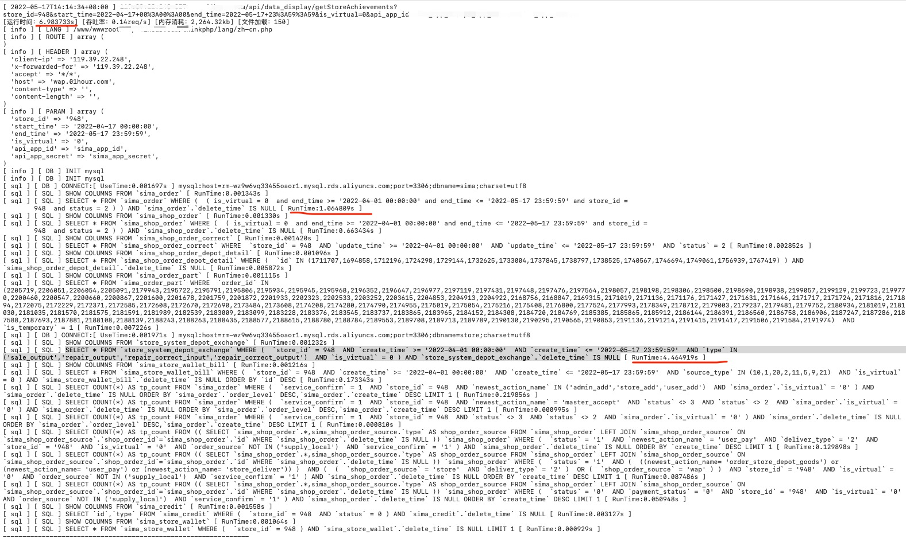

## TP5.1 SQL日志



总耗时6.983733s, 主要划线的两条sql合计5.5s占据。

## 分析

优先处理store_system_depot_exchange表 索引查看
```
mysql> SHOW INDEX FROM store_system_depot_exchange;
+-----------------------------+------------+--------------+--------------+-------------+-----------+-------------+----------+--------+------+------------+---------+---------------+
| Table                       | Non_unique | Key_name     | Seq_in_index | Column_name | Collation | Cardinality | Sub_part | Packed | Null | Index_type | Comment | Index_comment |
+-----------------------------+------------+--------------+--------------+-------------+-----------+-------------+----------+--------+------+------------+---------+---------------+
| store_system_depot_exchange |          0 | PRIMARY      |            1 | id          | A         |     2794646 |     NULL | NULL   |      | BTREE      |         |               |
| store_system_depot_exchange |          1 | storeId_type |            1 | store_id    | A         |         975 |     NULL | NULL   |      | BTREE      |         |               |
| store_system_depot_exchange |          1 | storeId_type |            2 | type        | A         |        3965 |     NULL | NULL   | YES  | BTREE      |         |               |
+-----------------------------+------------+--------------+--------------+-------------+-----------+-------------+----------+--------+------+------------+---------+---------------+
3 rows in set (0.00 sec)
```

数据查看，0.35s，这里复现不出生产环境**秒**级查询。
```
mysql> SELECT *   FROM `store_system_depot_exchange`  WHERE(`store_id`= 52    AND `create_time`>= '2019-09-01 00:00:00'    AND `create_time`<= '2019-10-17 23:59:59'    AND `type` IN('sale_output', 'repair_output', 'repair_correct_input', 'repair_correct_output')    AND `is_virtual`= 0)  AND `store_system_depot_exchange`.`delete_time` IS NULL;
...省略
:28 | 2019-10-17 09:55:28 | NULL        |          0 |
| 1607603 |    407375 |        0 |       3644 |            7609 | NULL         |        715 |   1 |       714 |       3.00 |       40.00 | sale_output           |       52 | 2019101753505152 | 2019-10-17 10:33:20 | 2019-10-17 10:33:20 | NULL        |          0 |
| 1607896 |    407475 |        0 |       2922 |          209508 | NULL         |          5 |   2 |         3 |       5.00 |       60.00 | sale_output           |       52 | 2019101710154509 | 2019-10-17 11:46:26 | 2019-10-17 11:46:26 | NULL        |          0 |
| 1608514 |    407651 |        0 |       3644 |          209547 | NULL         |          5 |   1 |         4 |       2.50 |       10.00 | sale_output           |       52 | 2019101710056511 | 2019-10-17 14:11:29 | 2019-10-17 14:11:29 | NULL        |          0 |
+---------+-----------+----------+------------+-----------------+--------------+------------+-----+-----------+------------+-------------+-----------------------+----------+------------------+---------------------+---------------------+-------------+------------+
999 rows in set (0.35 sec)
```

explain 分析
```
mysql> explain SELECT *   FROM `store_system_depot_exchange`  WHERE(`store_id`= 52    AND `create_time`>= '2019-09-01 00:00:00'    AND `create_time`<= '2019-10-17 23:59:59'    AND `type` IN('sale_output', 'repair_output', 'repair_correct_input', 'repair_correct_output')    AND `is_virtual`= 0)  AND `store_system_depot_exchange`.`delete_time` IS NULL;
+----+-------------+-----------------------------+------------+-------+---------------+--------------+---------+------+-------+----------+------------------------------------+
| id | select_type | table                       | partitions | type  | possible_keys | key          | key_len | ref  | rows  | filtered | Extra                              |
+----+-------------+-----------------------------+------------+-------+---------------+--------------+---------+------+-------+----------+------------------------------------+
|  1 | SIMPLE      | store_system_depot_exchange | NULL       | range | storeId_type  | storeId_type | 97      | NULL | 60632 |     0.11 | Using index condition; Using where |
+----+-------------+-----------------------------+------------+-------+---------------+--------------+---------+------+-------+----------+------------------------------------+
1 row in set, 1 warning (0.00 sec)
```

更改索引idx_storeId_createtime ，丢弃idx_storeId_type，type重复率高，放入索引没啥效果，选create_time高变动的数据。
```
mysql> CREATE INDEX idx_storeId_createtime ON store_system_depot_exchange (store_id,create_time);
Query OK, 0 rows affected (13.80 sec)
Records: 0  Duplicates: 0  Warnings: 0

mysql>  DROP INDEX idx_storeId_type ON store_system_depot_exchange; 
 Query OK, 0 rows affected (0.05 sec)
Records: 0  Duplicates: 0  Warnings: 0
```

再次查询
```
mysql> SELECT *   FROM `store_system_depot_exchange`  WHERE(`store_id`= 52    AND `create_time`>= '2019-09-01 00:00:00'    AND `create_time`<= '2019-10-17 23:59:59'    AND `type` IN('sale_output', 'repair_output', 'repair_correct_input', 'repair_correct_output')    AND `is_virtual`= 0)  AND `store_system_depot_exchange`.`delete_time` IS NULL;
....省略
----+---------------------+-------------+------------+
999 rows in set (0.02 sec)
```

## 有关 Mysql Select QC缓存

在阿里云的云数据库RDS中，语句第一次查询可以复现，但是第二次就快很多倍。想到的是缓存，就查了相关资料，了解到是Select Query Cache如下。

> 查询缓存使用情况
```
mysql> SHOW STATUS LIKE 'Qcache%';
+-------------------------+--------+
| Variable_name           | Value  |
+-------------------------+--------+
| Qcache_free_blocks      | 0      |
| Qcache_free_memory      | 0      |
| Qcache_hits             | 0      |
| Qcache_inserts          | 0      |
| Qcache_lowmem_prunes    | 0      |
| Qcache_not_cached       | 668762 |
| Qcache_queries_in_cache | 0      |
| Qcache_total_blocks     | 0      |
+-------------------------+--------+
8 rows in set (0.00 sec)
```

相关解释：

* Qcache_free_blocks: 查询缓存的可用内存量 如果该值非常大，则表明缓冲区中碎片很多。
* Qcache_free_memory: 查询缓存的可用内存量 Query Cache 中目前剩余的内存大小。通过这个参数我们可以较为准确的观察出当前系统中的Query Cache 内存大小是否足够，是需要增加还是过多了；
* Qcache_hits: 查询缓存命中数 多少次命中。通过这个参数我们可以查看到Query Cache 的基本效果； 
* Qcache_inserts: 添加到查询缓存的查询数 多少次未命中然后插入。通过“Qcache_hits”和“Qcache_inserts”两个参数我们就可以算出Query Cache 的命中率了：Query Cache 命中率= Qcache_hits / ( Qcache_hits + Qcache_inserts )；
* Qcache_lowmem_prunes: 由于内存不足而从查询缓存中删除的查询数 值非常大，则表明经常出现缓冲不够的情况;
* Qcache_not_cached: 非缓存查询的数量（由于 query_cache_type 设置而无法缓存或未缓存） 因为query_cache_type 的设置或者不能被cache 的Query 的数量；
* Qcache_queries_in_cache: 查询缓存中注册的查询数 当前Query Cache 中cache 的Query 数量；
* Qcache_total_blocks: 查询缓存中的块总数 表示当前查询缓存占用的内存的block数量


> 查找缓存开启情况

查询
```
mysql> SHOW  variables LIKE 'query_cache_type';
+------------------+-------+
| Variable_name    | Value |
+------------------+-------+
| query_cache_type | OFF   |
+------------------+-------+
1 row in set (0.00 sec)
```

**注意：即使是OFF, ALIYUN MYSQL在短时间内查询还是会使用缓存**

> 缓存关闭与开启

1、临时的直接再命令行执行

```
set global query_cache_size=0
set global query_cache_type=0
```

2、永久

my.cnf修改query_cache_size=0、query_cache_type=0


## 迭代

* 2022年05月17日 23:59:59 初稿

## 参考

1、[MySQL查询缓存简单使用 - pedro7 - 博客园](https://www.cnblogs.com/WangXianSCU/p/14490217.html)